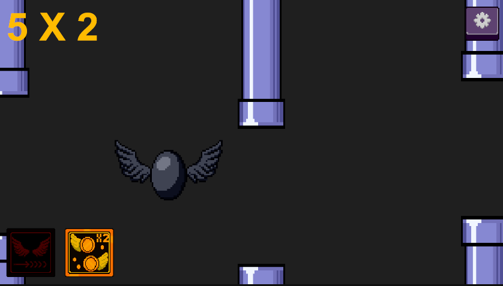

# The Flappy Dragon

Simple Flappy Dragon game made in Unity.

## Features
- Jump mechanic
- Score system & high score saving
- Sound effects & background music
- Pause menu
- Increasing difficulty
- Quit button

## Screenshots

## Tech
- Unity
- C#
- Aseprite

## Goal
First step into game development.

## Updates

### Alpha 0.0.5
- Settings Menu: Added settings panel with ability to toggle SFX and Music.
- Data Reset: Added option to reset saved data (PlayerPrefs).
- Coroutine Usage: Implemented coroutines for delayed scene loading after button sounds.

### Alpha 0.0.4
- Pause System: Added pause menu with resume, restart and menu buttons.
- Increasing Difficulty: Game speed increases every 5 points, making the game progressively harder.
- UI Overhaul: Separated UI logic into dedicated UIScript for cleaner architecture

### Alpha 0.0.3
- Improved UI: Enhanced menus and game over screens for better user experience.
- Audio Overhaul: Added new sound effects and a separate system for background music and SFX.
- Exit Function: Added a Quit button to exit the application.

### Alpha 0.0.2
- Added high score system (PlayerPrefs)
- Record saving between sessions
- UI improvements (score display)

## Bug Fixes

### Alpha 0.0.5
- Bug Fix: Fixed high score display issue.
- Bug Fix: Fixed button sound not playing before scene transition.

### Alpha 0.0.2
- Ghost Scoring: Fixed a bug where players earned points after death
- Fly-Away: Resolved an issue where dead players could still fly out of bounds
