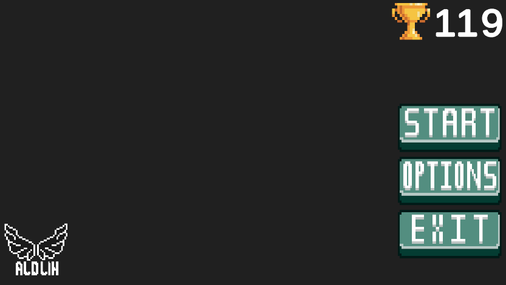
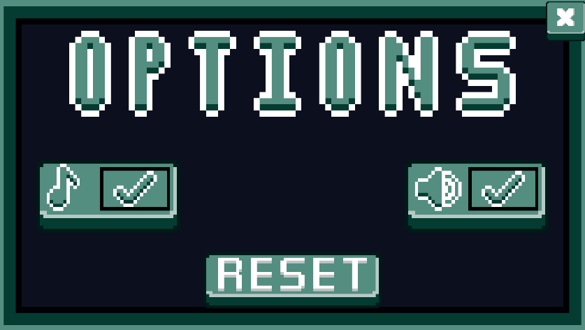
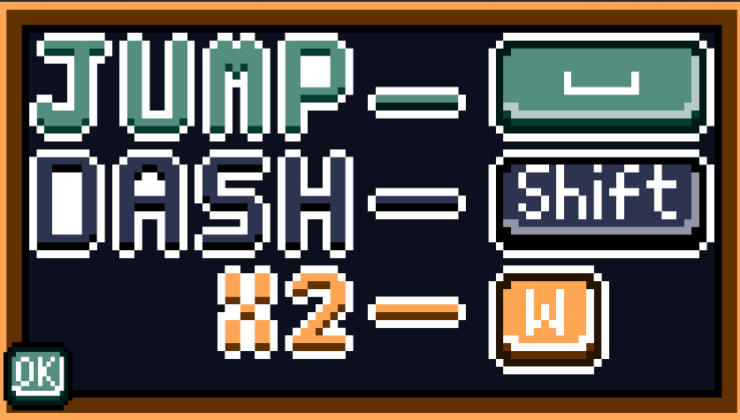
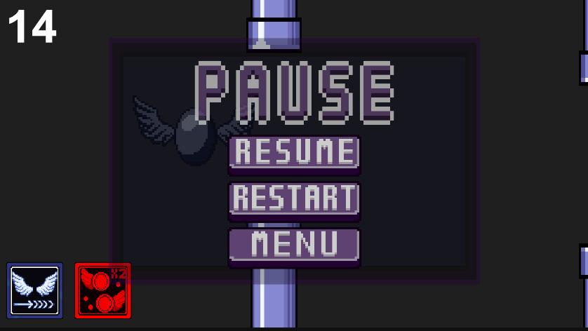
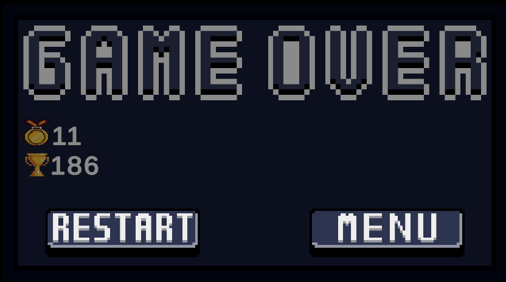

# 🐉 The Flappy Dragon

A fast-paced arcade game where you control a dragon, avoid obstacles, and use abilities to survive as long as possible.

---

## 🎮 Gameplay

- Tap / press to fly  
- Avoid pipes  
- Survive as long as possible  
- Use abilities to gain advantage  

---

## ✨ Features

- Smooth jump mechanic  
- Score system & high score saving  
- Increasing difficulty over time  
- Dash ability (burst speed)  
- X2 Score multiplier ability  
- Sound effects & background music  
- Settings menu (Music / SFX toggle)  
- UI animations (beta)  

---

## 📸 Screenshots

 
  
  
  

   

---

## 🛠 Tech

- Unity  
- C#  
- Aseprite  

---

## 🎯 Goal

This project is my first step into game development.  
The goal is to build complete games from scratch, focusing on gameplay, systems, and polish.

---

## 🔄 Updates

### Alpha 0.1
- Abilities: Added Dash and X2 score multiplier mechanics  
- Tutorial: Added first-time tutorial panel  
- UI Overhaul: Fully redesigned UI (menus, buttons, layout)  
- Visual Update: New sprites for dragon, pipes and UI  
- Audio Update: Added new sound effects and background music  
- Animations (Beta): Started implementing animations (wings, feedback)  

---

### Alpha 0.0.5
- Settings Menu: Added SFX and Music toggle  
- Data Reset: Added PlayerPrefs reset option  
- Coroutines: Delayed scene loading after button sounds  

### Alpha 0.0.4
- Pause System: Added pause menu (resume, restart, menu)  
- Increasing Difficulty: Speed increases every 5 points  
- UI Refactor: Separated UI logic into UIScript  

### Alpha 0.0.3
- Improved UI and game over screen  
- Audio system split into music & SFX  
- Added Quit button  

### Alpha 0.0.2
- High score system (PlayerPrefs)  
- Score saving between sessions  
- UI improvements  

---

## 🐞 Bug Fixes

### Alpha 0.0.5
- Fixed high score display issue  
- Fixed button sound not playing before scene transition  

### Alpha 0.0.2
- Fixed ghost scoring after death  
- Fixed flying after death  

---

## 🔗 Author

GitHub: https://github.com/AldLih